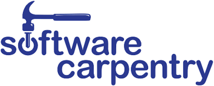
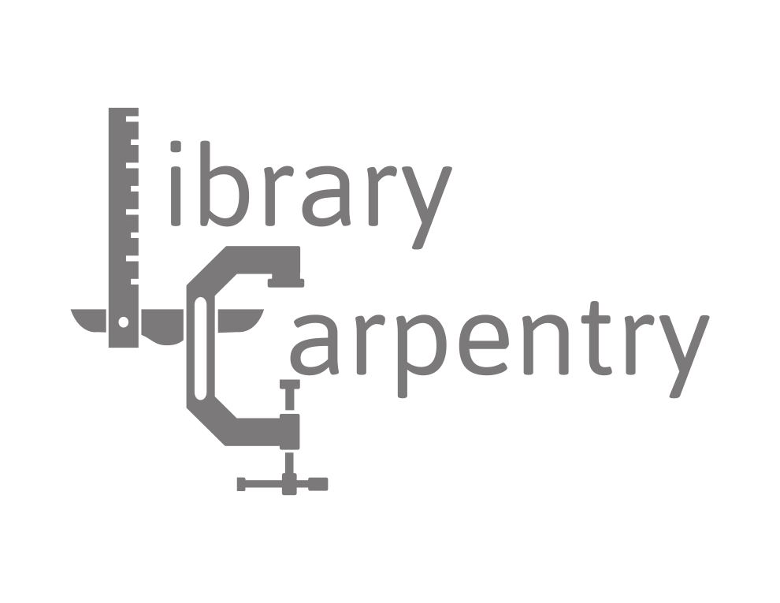
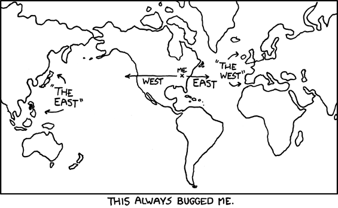
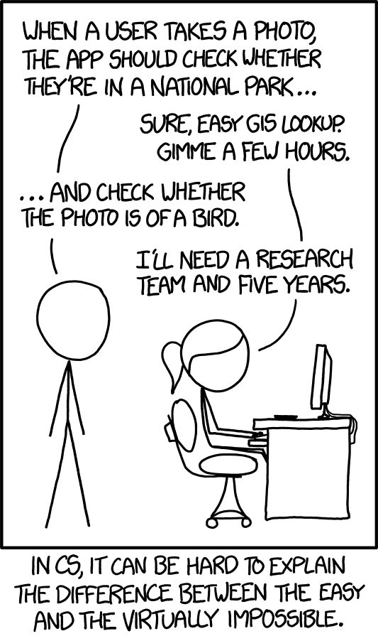
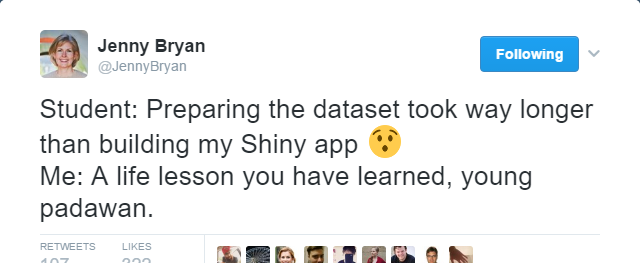
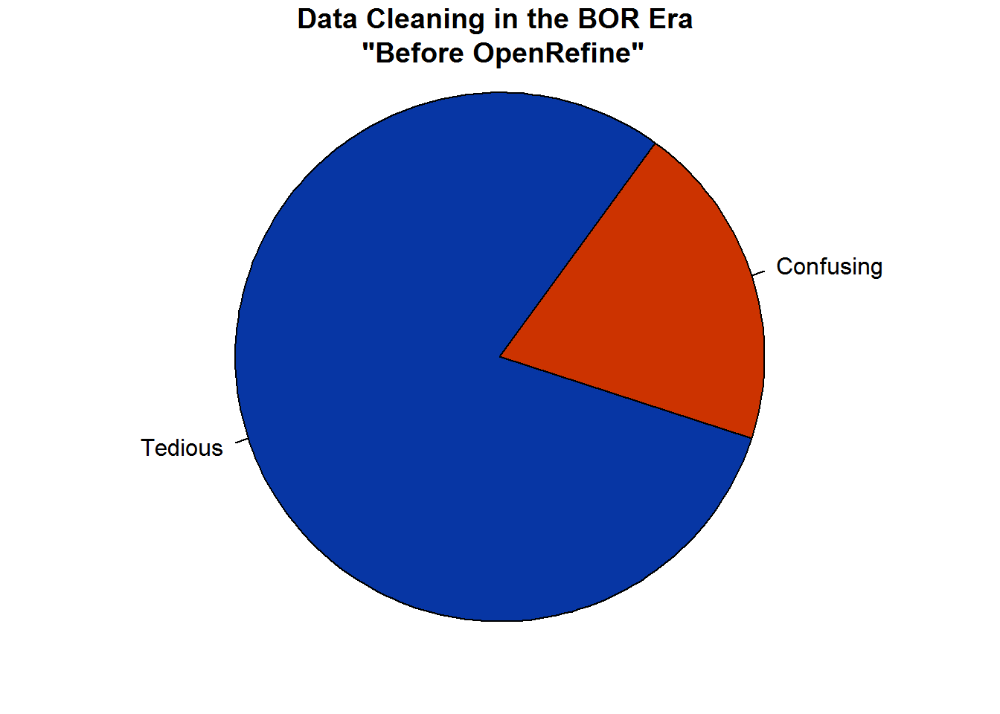
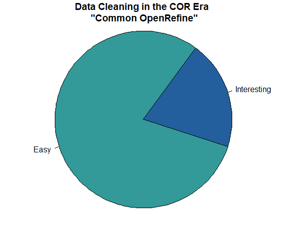
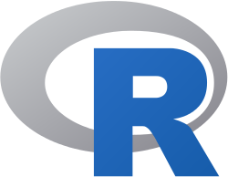
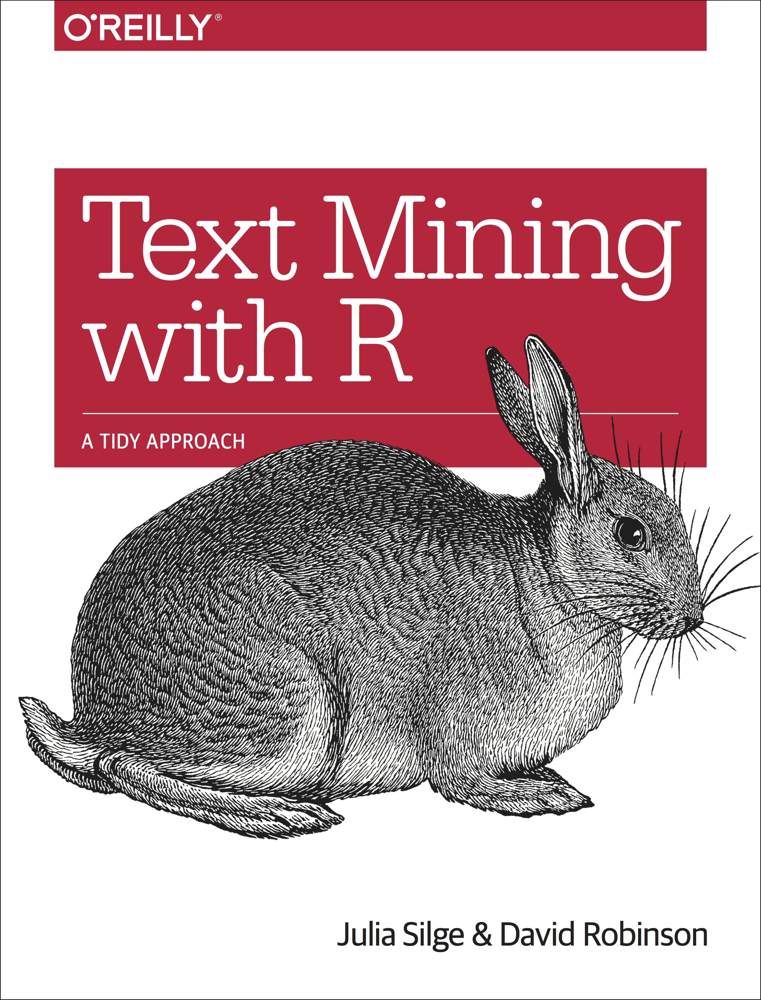

Presentation
========================================================
author: Adela Sobotkova
date: 24 July
autosize: true

Who am I?
========================================================
left: 70%
- Landscape/survey archaeologist
- eResearch infrastructure development in Australia (FAIMS project, offline human mediated data collection)
- Software Carpentry instructor
- Digital historian in Aarhus, Denmark
- https://github.com/adivea 

***


What [and how] are we going to learn this week?
========================================================
left: 80%
- Avoid pitfalls when managing data in spreadsheets
- Make data cleaning a breeze with Open Refine
- Work (run and edit scripts) in R
- Practice text mining in R

The schedule loosely follows the Carpentries curriculum. The Carpentries teach fundamental software skills for non-programmers in a social and friendly environment through learn-by-doing and learn-by-observation approach. 

The hands-on approach relies on the data-science notion of “hacking” (not “cracking”). We learn best together, by following templates, experimenting, and by working on our own projects.

https://adivea.github.io/2019-07-22-OX-LC

***





What do you mean by a 'digital archive'? Language Games
========================================================


https://xkcd.com/503/ 

 
What do you mean by a 'digital archive'? Jargon Busting
========================================================
Let's get a firmer grasp on the concepts around data, code or software development 

Task 1: 
- Pair with a neighbour and decide who takes notes 
- Talk for 3 minutes (your instructor will be timing you!) on any terms, phrases, or ideas around code or software development that you’ve come across and perhaps feel you should know better.
- Next, get into groups of 4-6.
- Make a list of all the problematic terms, phrases, and ideas each pair came up with. Retain duplicates.
- Identify common words as a starting point - spend 10 minutes working together to try to explain what the terms, phrases, or ideas on your list mean. Note: use both each other and the internet as a resource.
- Identify the terms your groups resolves as well as those you are still struggling with.
- Each group then reports back on one issue resolved by their group and one issue not resolved by their group.
- Let's discuss

 

Don’t think you work with data? Think again
========================================================

Task 1:
- Brainstorm all the different sorts of data you work with (examples might include metadata, catalogue data, legacy data, data ouptut from DROID etc.)
- Discuss your own data, trying to answer questions including; How much data do you have? Where is it stored? Who has access to it? How is it formatted or stored? Can you move it about easily - in and out of systems? In particular think about the tools you use to help you manage your data as well as any problems you have with it.

Task 2:
- select representative example of data you discussed previously
- map the lifecycle of a data point from the moment of creation to its long-term home or to disposition (long term transfer, destruction, etc.)
- Discuss: How many people or organizations have been custodians of the data? How many systems has it moved through? Is there a relationship between the individual(s) creating the data and those who make preservation or disposition decisions? How does the lifecycle of the dataset impact documentation, metadata, or the data itself?


Computers are stupid
========================================================
.. but they don't get tired.

People interpret. Machines don't. 
Computer only does what you tell it to. If it throws up an error it is often not your fault, rather in most cases the computer has failed to interpret what you mean because it can only work with what it knows (ergo, it is bad at interpreting).

*** 



https://xkcd.com/1425/


Regular Expressions
========================================================
Regular Expressions (regexes) are a powerful way to handle a multitude of different types of data. They can be used to find patterns in text and make sophisticated replacements. Think of them as find and replace on steroids. Come along to this workshop to learn what they can do and how to apply them to your research.

***


https://xkcd.com/208

Data in Spreadsheets
========================================================

Although huge quantities of data today are born digitally, most of us (including programming wizards) still work with data in spreadsheets. Handling and managing spreadsheets is the bread and butter of data work today, so we'll go over some time- and effort- saving tips.


Tidy Data
========================================================
- each variable forms a column
- each observation forms a row
- each type of observational unit forms a table

Hadley Wickham, *Tidy Data*


Data Cleaning - Open Refine
====================================
It has been [written](https://www.nytimes.com/2014/08/18/technology/for-big-data-scientists-hurdle-to-insights-is-janitor-work.html) that 80% of any data project is comprised of *data cleaning*. 



"For Big-Data Scientists, ‘Janitor Work’ Is Key Hurdle to Insights"
====================================
article by Peter DaSilva at http://bit.ly/dirtydatahurdle

Not only Big-Data Scientists have messy data


Data Cleaning - Open Refine
====================================

Think of data cleaning as a puzzle rather than a tedium.  Data cleaning is a necessary step. If given short shrift, your data will become problematic and the cleaning process will still have to be addressed.
***


Remember old adage: "garbage in, garbage out".  Clean your data and decrease the chances of producing garbage.  Keeping in mind that the bulk of any data project involves data cleaning, you may as well have the best tools at your fingertips; you may as well do a good job; and, you may as well enjoy the puzzle. OpenRefine to the rescue... 


Comparative advantage of Open Refine vs. Excel
====================================
Easy
- Menu driven faceting, and filtering
- Clean up data inconsistencies using powerful clustering and edit algorithms
- Transforming data

Advanced power comes from Regular Expressions implementation via GREL
- Web scraping: API orchestration, HTML/JSON parsing
- Data transformations 


|  Expression Language | Expression |
|---|------------------------------------------------------------------------|
GREL | `value.match(/`<span class="highlight-yellow-fixed">(\^&#91;0-9&#93;\{1,2\}\\w\\w)</span>`\s(.*)/)[0]` 
Excel Formula | `INDEX(salary!$C$1:$C$4,MATCH(1,('player DB'!$A2=salary!$A$1:$A$4)*('player DB'!$B2=salary!$B$1:$B$4),0))`


The Holy Grail
====================================
Refine supports **reproducible** research. Working in Refine makes your messy data processing into a transparent, reversible, and repeatable process.  

- **Undo**:  every step is recorded and can be undone.
- **Share**:  your steps are recorded and can be shared in a JSON notation
- **Rerun**:  did I say your steps are recorded?  Not only that, but those "recordings" can be shared with others or re-run on future data.
- **Projects**:  each OpenRefine "project" retains a history of all your steps.  The project can be exported and subsquently imported to other instances of OpenRefine.
- **Exporting**:  There is a powerful export mechanism that allows you to build selective reports


Why Open Refine?
====================================
right: 20%
You don’t want to be a data engineer, but you need to fix your data
- Don’t have to deal with file handling
- Don’t have to deal with iterating (looping logic)
- Don’t have to write complex conditional statements
- Don’t have to think hard to manipulate arrays

Or, you are a lazy programmer (i.e. a smart programmer)

Or, you are a subject matter expert and Refine is the right tool for the job

***


Open Refine (Testimonial by John Little from the Duke University Libraries)
====================================

There are other programming languages/tools (such as R, Python, Excel, or Google Sheets) which can accomplish many of the same tasks.  The unique advantage for <i>Refine</i> may be the clustering technology. It is easy to find and correct spelling variations, or generally clean dirty and unstructured data.  Indeed, for the specific task of data cleaning, OpenRefine is unquestionably easy to learn and easy to use.  The power of the menu operations afford sophistication without having to memorize programming language syntax or commands.  If you're not a programmer this can be a huge value.  Essentially you can remain a subject expert in your field but perform powerful transformations without feeling like you are on dual-track treadmill -- trying to become a programmer and a subject expert. 
OpenRefine relieves me of the need to memorize file handle syntax, file management, or even looping and logic structure syntax.  But all of those techniques are availble to me if and when I really want them.  For programmers there is a benefit of not clouding up your wetware with a whole passel of commands which might only confound you as they muddle your expertise with another programming language.  (Oh, I know this never happens to *you*, but it does to others -- I've heard told).  Combine ease-of-use qualities with reproducibility and it's almost mind boggling that <i>Refine</i> is not more famous.  The simple secret is <i>Refine</i> is easy to learn <i>and</i> offers an extensible  feature set.  In short, OpenRefine produces dividends for the effort you put into it.  And it really grows on you.  
I hope you enjoy learning about OpenRefine.

User documentation is the ["Official Documentation Wiki"](https://github.com/OpenRefine/OpenRefine/wiki)

- [The *Using OpenRefine* Book, the email list, and other stuff](http://openrefine.org/documentation.html)


Introduction to R
========================================================

My assumptions:
Archive/Library data is not unique
Archive/Library data may have some consistently unique challenges
Data savvy skills should emphasize technique, tools, and approach
-Techniques: Reproducible, Scripting
-Tools: R / RStudio / Tidyverse
-Approach: Open Source and CC-BY are foundational.

For anyone intending to develop core competency as a data savvy staffer, i.e. become more than a comfortable beginner, using a fully capable data science scripting language is the *best midterm investment* from a skill building perspective.


***



What about alternatives
========================================================
They are also great. Go for them if you have the skills or support!


https://xkcd.com/1987/


Introduction to R - The Narrative :)
========================================================
R has become and tool of choice for data science explorations. R - a statistical programming language - and Tidyverse - a consistent way of applying and learning data science - are an excellent toolkit that can can be broadly applied when producing (and documenting) data summation projects. This toolkit is an excellent option for advanced beginners to advanced intermediates. For one, you can build on all that you learn, rather than have to learn 12 different applications. Additionally, R as a tool, along with version control, lends itself to reproducibility, portfolio building, on the way writing reports in various formats (MS Word, PPT, slides, web pages, blogs, dashboards, PDF, etc.). As you become engaged with these best practices you will spend less time on the data science and more time engaging with the data. You’ll write various reports from one script (web scrape, web publishing, PDF docs) by employing extensible data savvy techniques. While R (or Python) can have a steep learning curve, the tool will carry a data miner farther than entry level tools – which, while designed for easy of use, quickly reach an efficiency barrier). What better to use scalable techniques that were built for sharing, documentation, reproducibility, openness, and collaboration.


Text Mining with R
========================================================
right: 30%
One of the features of humanistic datasets is that these are often unstructured and text-heavy.
In addition to handling tabular and rectangular data; therefore, many of us need to understand how computers handle natural language. We will explore quantitative text analysis with [*tm* package] (https://cran.r-project.org/web/packages/tm/vignettes/tm.pdf)

Other R packages exist to help with text analysis:
- corpus
- [tidytext] (https://www.tidytextmining.com/index.html)
- [tokenizers] (https://programminghistorian.org/en/lessons/basic-text-processing-in-r#learning-goals)
- [quanteda] (https://quanteda.io/)

This section will serve as an introduction to text mining. We will do a quick exercise and discuss the difference between the different approaches and tools. Here are some official [mappings of the differences] (https://quanteda.io/articles/pkgdown/comparison.html) and [examples of use] (https://rpubs.com/Custer/text_exploration).

***



Tidy data > Tidy text
========================================================
Using tidy data principles is a powerful way to make handling data easier and more effective, and this is no less true when it comes to dealing with text. As described by Hadley Wickham (Wickham 2014), tidy data has a specific structure:

- Each variable is a column
- Each observation is a row
- Each type of observational unit is a table

We thus define the tidy text format as being a table with **one-token-per-row**. A token is a meaningful unit of text, such as a word, that we are interested in using for analysis, and tokenization is the process of splitting text into tokens.

Tidy text example
========================================================
Emily Dickinson wrote some lovely text in her time.

```r
text <- c("Because I could not stop for Death -",
          "He kindly stopped for me -",
          "The Carriage held but just Ourselves -",
          "and Immortality")

text
```

```
[1] "Because I could not stop for Death -"  
[2] "He kindly stopped for me -"            
[3] "The Carriage held but just Ourselves -"
[4] "and Immortality"                       
```


***

```r
library(tidytext)

text_df %>%
  unnest_tokens(word, text)
```

```
# A tibble: 20 x 2
    line word       
   <int> <chr>      
 1     1 because    
 2     1 i          
 3     1 could      
 4     1 not        
 5     1 stop       
 6     1 for        
 7     1 death      
 8     2 he         
 9     2 kindly     
10     2 stopped    
11     2 for        
12     2 me         
13     3 the        
14     3 carriage   
15     3 held       
16     3 but        
17     3 just       
18     3 ourselves  
19     4 and        
20     4 immortality
```


Tidy text vs. other data structures 
========================================================

Tidytext packages stores text data in a dataframe (**one-token-per-row**), which contrasts with the ways text is often stored in other text mining approaches.

- **String**: Text can, of course, be stored as strings, i.e., character vectors, within R, and often text data is first read into memory in this form.
- **Corpus**: These types of objects typically contain raw strings annotated with additional metadata and details.
- **Document-term matrix**: This is a sparse matrix describing a collection (i.e., a corpus) of documents with one row for each document and one column for each term. The value in the matrix is typically word count.


Tidy text workflow 
========================================================


A flowchart of a typical text analysis using tidy data principles (after Silge and Robinson, Fig.1.1)


Silge & Robinson (2019) provide a fantastic scaffolding for learners who wish to work with tidytext on well-formed example texts such as novels in the Gutenberg project or R-packaged versions of J. Austen texts. Tidytext package builds on tidyverse, which has more elegant data wrangling tools, but you'll think it's nice only if you already know it (see text pre-processing [differences](https://janzilinsky.com/pre-processing-text-data-in-r/))


Today's approach
========================================================

*tm* is a text-mining framework that uses corpus as the main data structure. It is built on base R, not tidyverse. 
It can deal with messy data you OCR-ed in a far-flung archive. Once you learn one package, understanding the next is easy as pie.

URL for text mining

Trump speeches in R


Additional Resources
========================================================
- [Election speeches in Australia] (https://electionspeeches.moadoph.gov.au/explore)
- [The Difficulies of My position"; the diaries of Prison Governor John Buckley Castieau, 1855-1884](http://nla.gov.au/nla.obj-5684781/view?partId=nla.obj-5685532#page/n7/mode/1up)
- [Processing Obama speeches in R] https://programminghistorian.org/en/lessons/basic-text-processing-in-r#learning-goals

Text mining with Python:
- https://programminghistorian.org/en/lessons/text-mining-with-extracted-features 
- https://programminghistorian.org/en/lessons/analyzing-documents-with-tfidf

Other tools especially for historical texts:
- [Tesserae](https://github.com/tesserae) - for exploring intertextuality
- [Tracer](https://www.etrap.eu/research/tracer/) - suite of 700 algorithms for text analysis
- [Language Analysis Tool](https://github.com/jiemakel/las) - CLI tool for lemmatizing, morphological analysis, inflected form generation, hyphenation and language identification of multiple languages.
...
